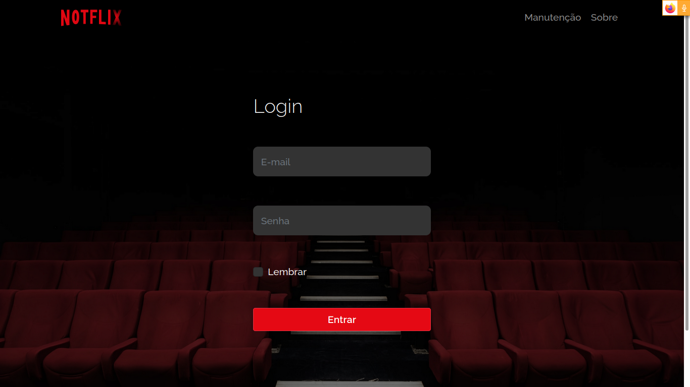
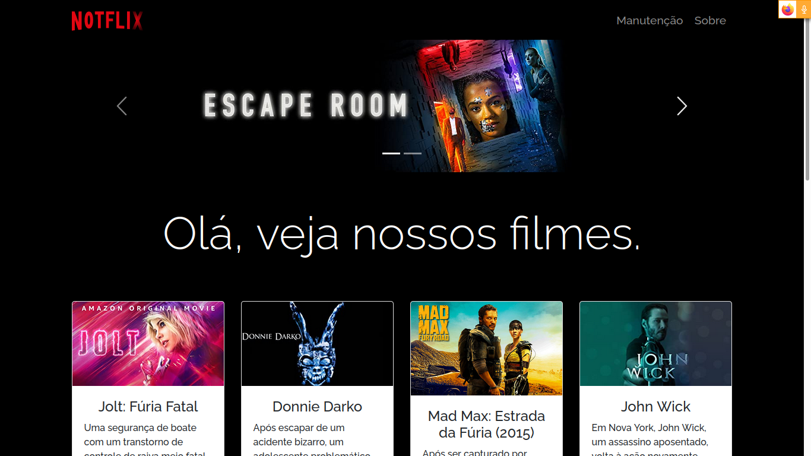
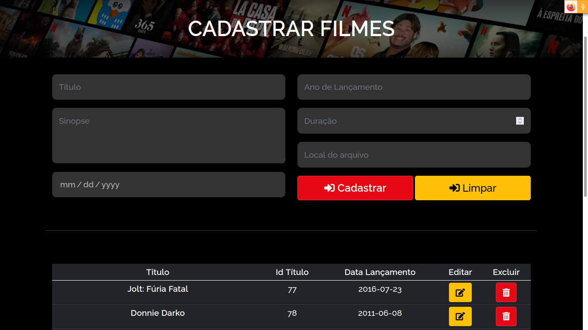

# Banco De Dados (Trabalho Prático)
Repositório destinado ao trabalho prático da matéria 
Banco De Dados I ofertada pelo departamento de computação UFS

# Descrição do projeto
O trabalho prático consiste na **modelagem e criação de um banco de dados**, além do **desenvolvimento de aplicação que irá fazer o CRUD** (Create, Read, Update and Delete) das entidades envolvidas no projeto. O projeto escolhido envolve entidades referentes a um serviço de filmes (semelhante a um Netlfix, Prime, etc).

Obrigatoriamente, a aplicação desenvolvida deve ser **Web ou Mobile**. A aplicação deve ter um **front-end** e um **back-end**. O front-end será responsável pelas telas de cadastro e consulta das entidades. O back-end deverá conter o SGBD que armazenará os dados e as rotinas necessárias para o armazenamento.

A aplicação deve ser acessível de qualquer computador/dispositivo móvel. Assim, o
grupo deve usar uma **estrutura de nuvem disponível**. A recomendação é utilizar o
Heroku (tutorial disponibilizado no SIGAA), mas o grupo pode usar qualquer outro
Iaas ou Paas (Azure, Aws, etc.).

# Telas

# Referências
- [React](https://pt-br.reactjs.org/)
- [Bootstrap](https://getbootstrap.com/)
- [Node](https://nodejs.org/en/)
- [Netflix](https://www.netflix.com/br/)
- [Prime](https://www.primevideo.com/?_encoding=UTF8&language=pt_br)

