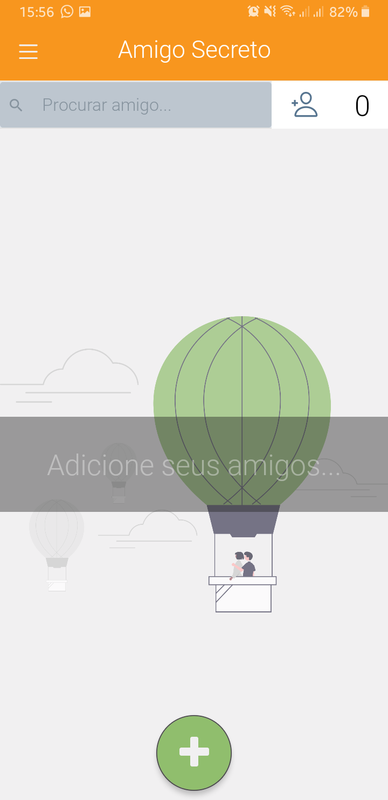
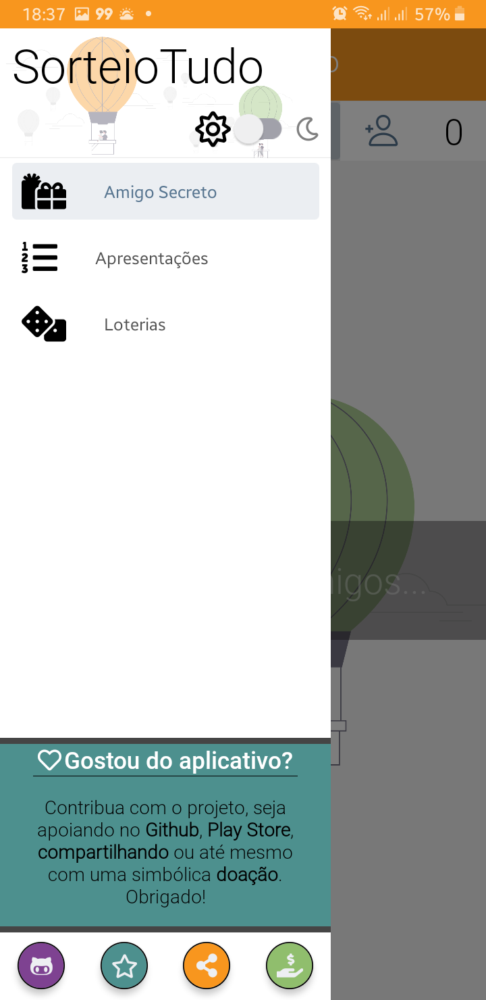

# Aplicativo Mobile de Sorteios *(Em desenvolvimento)*
Permite a realização de sorteios de diversos tipos:
- Amigo secreto
    - Cadastre o *email* e *nome* de todos seus amigos que irá participar do sorteio. Depois é só realizar o sorteio e disparar os emails, cada integrante irá receber seu amigo-secreto via email.
- Surpresinha Loto
    - Realiza sorteio de números aleatórios para apostas, e apresenta os últimos resultados.
- Sorteio Instagram
    - Realiza sorteio de comentários em postagens.
- Soteio de Apresentações
    - Sorteia a ordem de apresentação de grupos ou pessoas para um determinado seminário.

# Telas

  
  
  
  
  

# Tecnologias
- JavaScript
- React/Rect-Native
- Node.js
- Redux